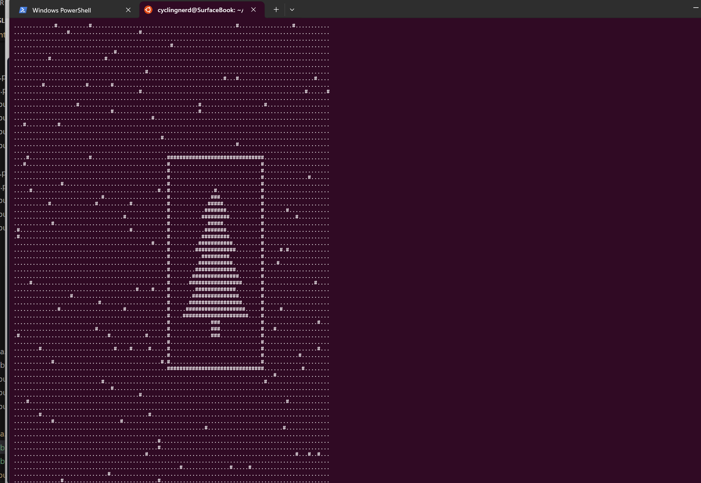

# advent_of_code_2024
final fun in 24

Project is created before 1st of December, i am raedy to support the elves!

### Day 1: 

a) Sort and add differences and result of some multiplications

b) Simply count some numbers, nothing to say here

### Day 2: 
a) Analyze sequences of integer values - stetigkeit and smooth in- or decrease. Lots of comparisons and handling if indices
b) My solution is a little bit brute force - just create all possible lines by deleting one character at a time
### Day 3: 
a) Just find all "mul(X,Y)" and execute these multiplications - can be done easily by using regular expressions

b) Interpretation of do() and don't() - i just deleted the text sequences with my text editor (vi) - and used the 3a-solution afterwards. So, no 3b here

### Day 4:
a) Finding: "XMAS"-Strings forward, backward, up, down, diagonal in a 2-dimensional character-array. I used just from left to right and one diagonal sequence, then turning the matrix by 90 degrees (three times).

b) Same with 4b: Just find "MAS" from top left to bottom right and bottom left to top right - then turn the matrix by 90 degrees times (three times).

### Day 5:
a) Many rules ("page ordering rules") between integers can be interpreted as a directed graph. If you do so and create such graph (easy with Python and nx-library), you can simply check the validity of a sequence of numbers by checking if the necessary edges exists

b) The incorrect sequences must be corrected: start from beginning of the sequence and if there is no edge between to nodes, just exchange the nodes and try again for the sequence. This solution is possible, because we know that **every** sequence can be corrected. 

### Day 6:
a) Just traveling through a maze... i did it just without thinking, straingforward

b) We need to place a something in the way, so that we are endlessly caught in the maze. I did it, but it is a total mess as i use EVERY plot of the maze in my solution. After more thinking, it should be simply enough to use any field which we walked through in solution a. My solution works, but it of course it is very slow and inefficient.

### Day 7:
a) After thinking for a long time (i am getting old) i was able to see, that this is a simple tree-search and therefor a simple recursive solution. After doing the thinking, the implementation is really very easy

b) Ok... just takes 2 more lines - too easy for a part b on day 7 - but ok for an old man ;-)

### Day 8:

a) Not much to say, nothing special, calculating a little bit and checking allready taken positions in the representation of a map

b) Some more calculations, nothing special here either. The only thing which took me some time: to read and understand the exercise ;-)! In contrast to exercise 8a, in 8b the "antennas" needs to be taken into account, but not all of them...  

### Day 9:

a) A bit annoying exercise. I had no good ideas, so i just implemented it straight forward - but it took some time. Playing around with lists... 

b) Same as a... not really difficult, but took me some time because of all the step-by-step looking at what happens. I am getting old ;-)

### Day 10:

a) Ok, nice exercise. It is a kind of breitensuche, recursiv function can solve that. I made the mistake to solve accidently part b), so took some time to read the exercise carefully and solving it afterwards.

b) Ok, after solving part b) accidently, this was done in minutes. But nice.

### Day 11: the stones...

a) Part a was done as described, splitting some "stones" and inserting them into the list... but...

b) I almost failed this time: There is no way to work on the list, as it grows exponentially. After a really long time to think and starring at the numbers, i finaly got it: The numbers on the stones **do not** grow that fast, not even linear with the length of the list. So just work on a dictionary to store the stones with certain numbers, as the order is not needed. Puh...

Took me more than 90 minutes - so: after work party

### Day 12: the fences and the plants

a) Nothing special here, work around on the map, count your steps, "place" fences, count at the end

b) Well, there might be a lot of solutions for that. I used the solution for a and added information about the direction during walking through the map to each fence. After that, i analyze the fences and check if they are neighbours and if their direction is identical.

Took me more than 90 minutes - so: after work party

### Day 13: that claw machine

a)  Two buttons, one target. Exercise *a* was done by me with a brute force solution. But it was clear, that this might not be feasable for b)

b) And yes, no way to use it for b). The solution here is to solve a linear matrix (?... my english) and google helped me to find numpy for that kind of stuff. But: I took me a while to understande, that the precision with the python implementation lead to some errors. So i did it the dirty way again: Find a solution with numpy, then using a brute force solution to find the exact position, accepting only integers. Sound weird, but it works. 

Took me more than 90 minutes - so: after work party

### Day 14: the robots, the restroom and...

a) Easy, just calculating some position on a map. Really, easy. Could be a exercise for day 1

b) But then came b!) And b is really wonderfull! Finally, i learned a lot about modulu ('%'-operator), and it is impressive, of how humans are able to identify a christmas tree! Really, a wonderful, surprising exercise as part b).

And it is weekend - so no worry about the time i spent here  - perfect for this one!

### Day 15: pixel game

a) moving "goods" around in a maze - ok, nice, took some time, but a nice one for 3rd advent 

b) Oh, the "goods" are not wider, same to the maze. That brings up more interesting possibilities to move them around. Took me a lot of time and i learned some more about python... i liked that one.

### Day 16: Dijkstra...

a) Ok, that day had to come, and here it is. Solving this one means you need to know about some graph.theorie. And yes, better you use some libraries for this one

b) Even harder. To be honest, at the end i used bing and copilot to solve this one. A little bit frustrating. 

No, i don't like these ones... Hope for tomorrow. But from now on, it might be much, much harder.

### Day 17: that 7-bit machine...

a) straight forward - i just implemented all the required functions (bxl, adv, etc.), parsed the input and runs smoothly. I really felt good, but then came part b!

b) ... really, no idea. Simply no idea. I tried for hours to see something, but no way. I know a lot about the statements, tried to implement a "reverse" machine but it all failed. So, no solution for b. Bits are shifting around, the solution has 16 * 3 bits, i do know all of that, but how...

### Day 18:

a) After my personal deasaster with day 17, that was (too) easy, as wehave another maze and i just reused day 16. And waited for the horror of b... but...

b) ?!?! That was really allmost the same, and i solved this one with a shell script which just creates shorters forms of the large input file

### Day 19: My personal ground zero - i am out

a) Easy, nice. Nothing so speacial, i implemented this with a recusrive function and found the solution quiet fast. I wanted to solve part b in the train to Hannover today, but then came b

b) My solution worked for the simple input (the smaller exmaple). With the real data, my solution wrote 16 GB of logfile before i stopped the mess. I wasn't able to calculate the result for not even one of the possible inputs - and there are 400! So - again (after day 16), no idea. But what i did then was embarassing and it becamme my personal ground zero: I used copilot. But not the "normal" way, so just like a better code completion. I just opened the chat window and pasted the whole input text from Day 19 into it. I got a program as a result. I simply pasted my code for reading the input from a file, and started the code. It generated a wrong number for the overall result. So i said, hey, the result should be 16 (as it is stated in the exercise - and as my own program showed for the smaller input file). So, it did some corrections. I started, and boom: 16. Ok, i didn't look at the solution, just changed the filename to the larger input file. Then again. and BOOOM: after not even one second a huge number (> 10^15) shows up. I did a copy/paste, and now i had two stars, and NO IDEA how that solution was working. I just asked copilot, and i got a lot of explanations about "Dymamic Programming". Ok, well... yes... but... how... 
Ok, but officially i cheated - and so i am out (and Dirk will win the pocal)

